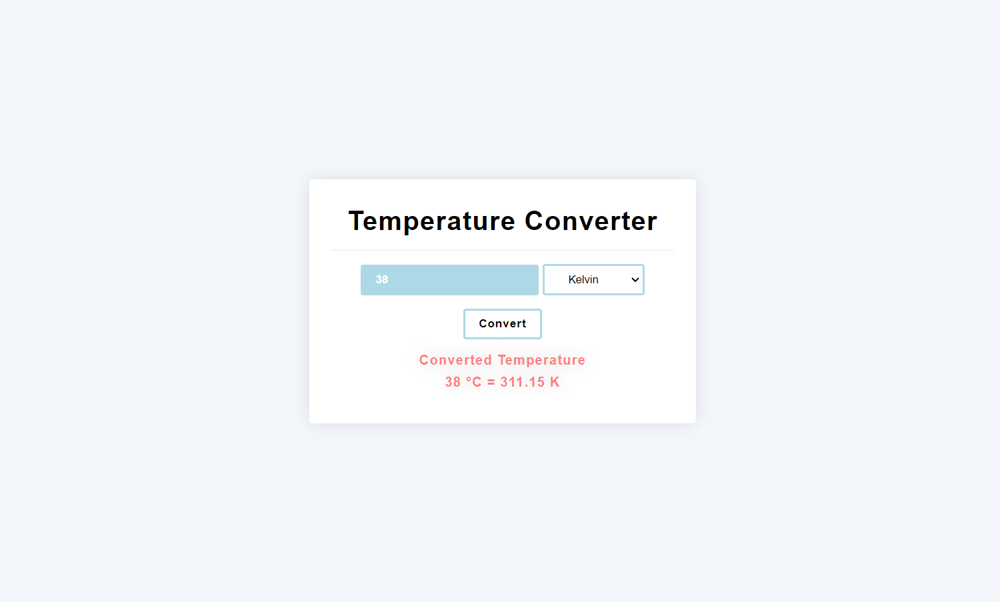

# OIBSIP-LEVEL1-TEMPERATURE-CONVERTER-WEBSITE

### Task - 3 TEMPERATURE CONVERTER WEBSITE 

# Temperature Converter

A simple web-based temperature converter that allows users to convert temperatures between Celsius, Fahrenheit, and Kelvin.

## Features

- Input field for users to enter a temperature.
- Dropdown menu to choose the input unit (Celsius, Fahrenheit, Kelvin).
- Convert button to trigger the temperature conversion.
- Display area for showing the converted temperature and unit.

## How to Use

1. Enter the temperature in the input field.
2. Select the input unit from the dropdown menu (Celsius, Fahrenheit, or Kelvin).
3. Click the "Convert" button.
4. The converted temperature will be displayed below with the appropriate unit.

## Demo

## Installation

There's no need for installation. Simply open the `index.html` file in a web browser to use the temperature converter.

## Technologies Used

- HTML
- CSS
- JavaScript

